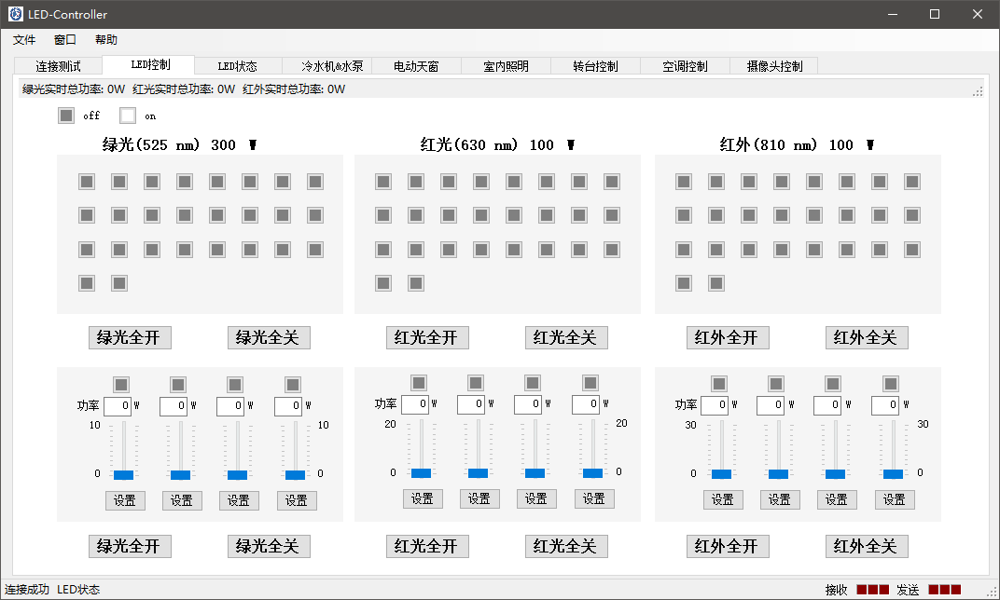

# LED阵列控制器

本项目提供LED阵列控制器上位机程序，用于控制用于某项目标定的LED阵列开启控制。主要包括的功能有

- [x] 与下位机进行连接，通讯
- [x] 控制单个和LED阵列的开启和关闭，调节LED输出功率
- [x] 实时显示LED的状态
- [ ] 天窗的控制
- [ ] 转台的控制

需要做的事情

- 在**LED状态界面更行LED按钮对应的颜色**
- 界面美化

## 开发人员

- 殷振平，zp.yin@whu.edu.cn