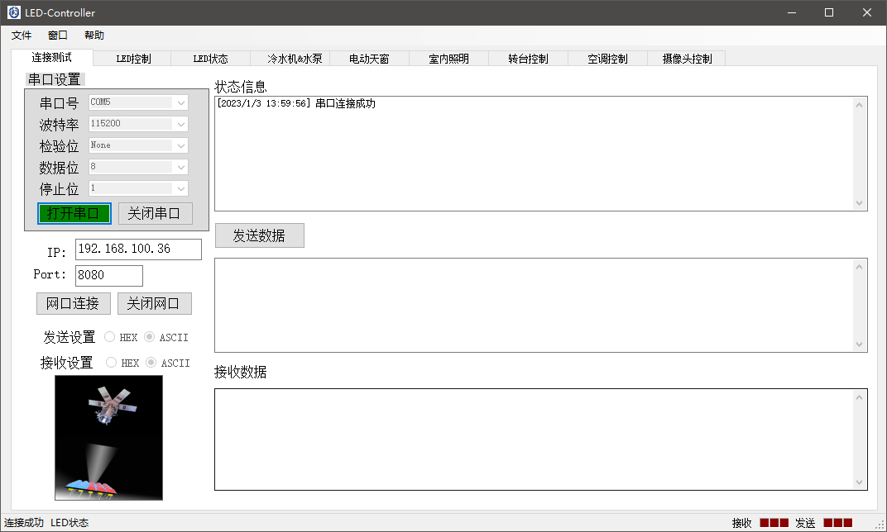
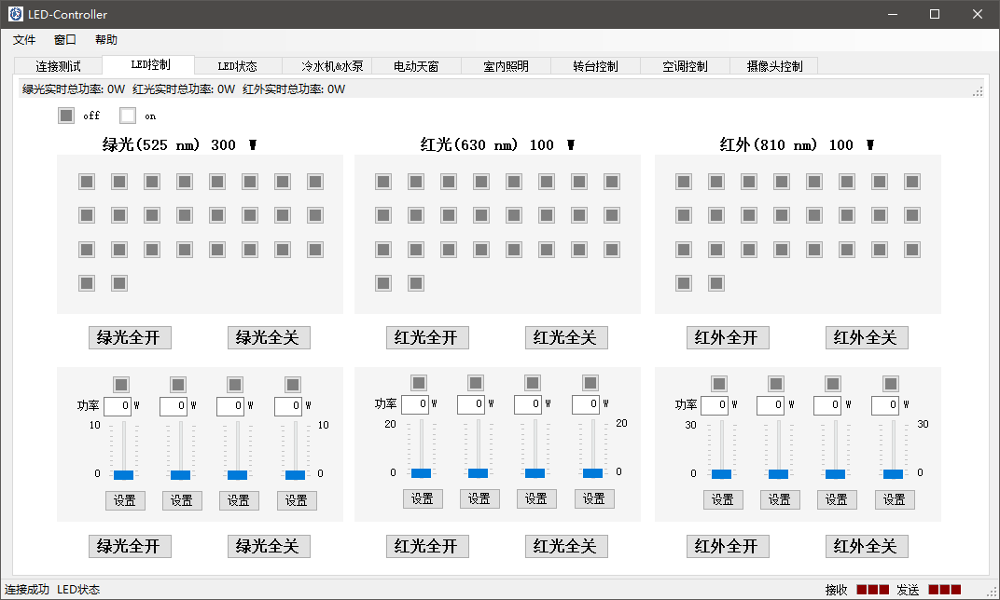
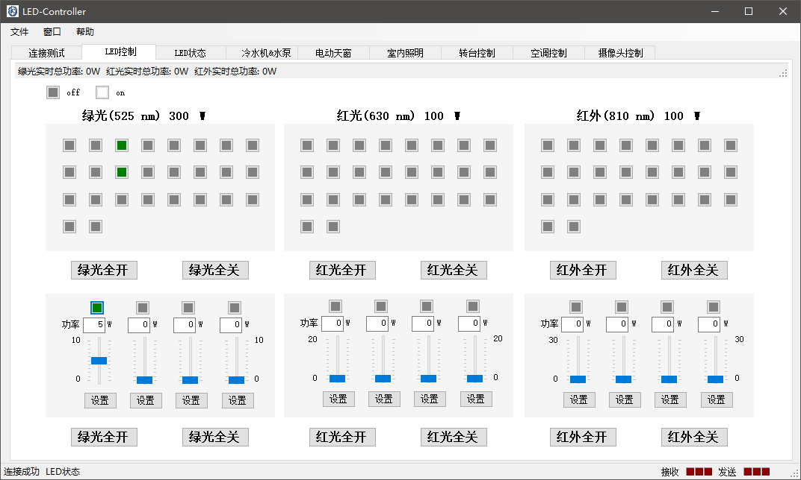
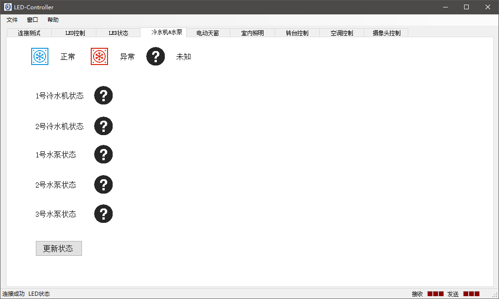
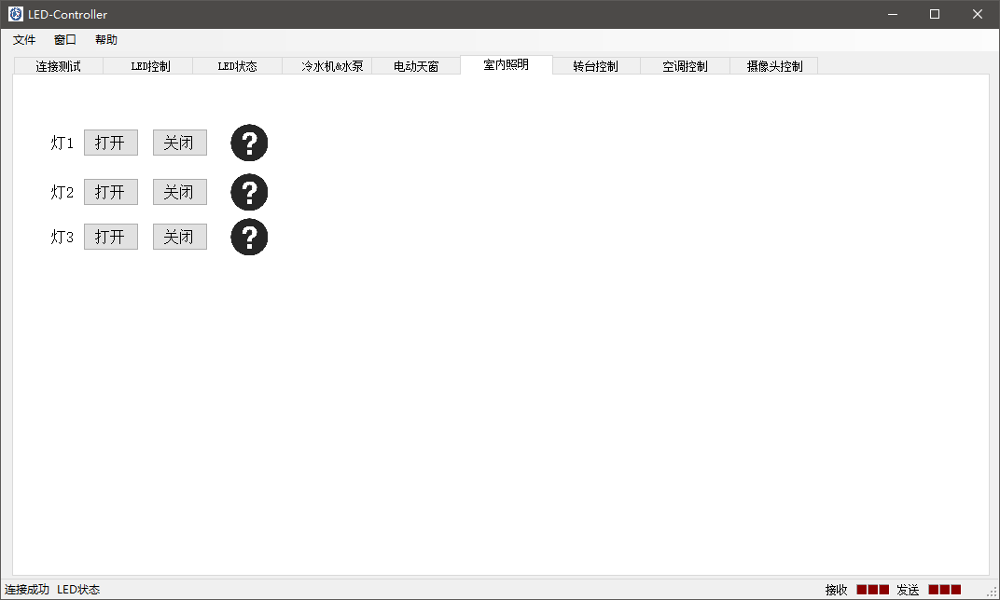
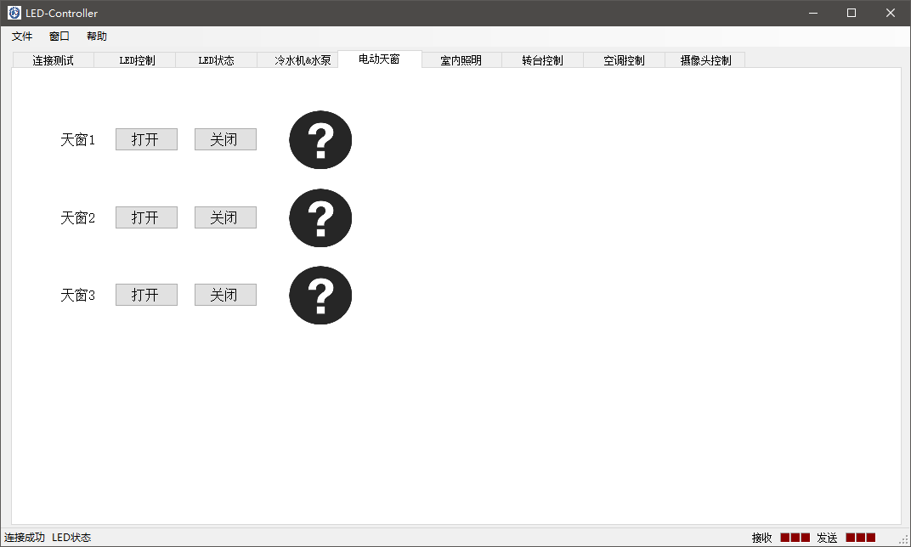

# LED控制器说明

LED控制器是用于跟LED阵列进行连接并发送控制指令的界面，相当于LED阵列的控制器。LED阵列由3个子阵列组成，详细信息如下

- 子阵列A（红色LED）：26个固定功率LED和4个可调功率LED组成
- 子阵列B（红外LED）：26个固定功率LED和4个可调功率LED组成
- 子阵列C（绿色LED）：26个固定功率LED和4个可调功率LED组成

对于每个LED可以发送开(ON)和关(OFF)的控制指令，并且对于可调功率的LED，还可以发送功率控制的指令，用于调整LED发光亮度。
对于每个LED均可以查询其当前功率、电压和电流强度。

具体参考[方案B](方案B.pdf)。

除了控制LED以外，该控制器还可以控制方舱中的一些设备，如查询冷水机和水泵的报警状态、对天窗进行开关控制和对方舱内部的灯进行开关控制。

## 使用说明

LED控制器用于连接LED控制单元、发送LED控制指令、读取LED状态信息和发送其他开关的控制指令。

### 连接

LED控制器支持串口连接和TCP连接方式，通过设置连接端口信息，即可与控制单元进行连接。当连接成功时，则返回连接成功的状态信息。

在连接成功后，可以进行简单的发送和接收数据测试。并且接下来的控制指令均需要保持成功的连接状态。

### LED控制

点开LED控制单元，可以对单个LED发送控制指令。其中将固定亮度LED和可调亮度LED分为上下两块，上面表示固定亮度LED，下面表示可调亮度LED。

该单元中的每个方块分别代表一个LED，点击方块可以控制LED的开与关。如果LED打开，则方块会有相应的颜色显示（绿色LED显示绿色），否则则为灰色。

对于每个LED，当鼠标在上面停留时，则会触发LED状态查询的指令，对应的LED状态会显示在左下角的状态栏。

LED的总功率会按特定时间进行查询，并显示在左上角的状态栏。

### LED状态显示

通过设定查询LED的状态量、查询重复时间，并点击开始获取，即可将每个LED对应的状态以相应的颜色，显示在每个LED方块上。并且LED的总功率、电流和电压会以心电图的形式刷新在左下角的图表中。

通过设置数据保存目录，会将查询的状态信息以ASCII文件形式保存在对应的数据目录中。

### 冷水机状态

通过点击`更新状态`，即可查询当前冷水机和水泵的报警状态，并在图片中进行显示。

### 室内照明

### 天窗开关

### 保存运行状态

对于当前运行的LED阵列状态，可以在`文件`列表中点击保存，即可将LED阵列状态保存到ASCII文件中，并且在下次开机时可以直接打开，完成加载。

## 设计说明

整体界面设计采用MVP架构，即Model-View-Presenter。通过View设计界面，并产生事件信息；Presenter承接事件的处理，并调用Model中的事件处理逻辑，对事件进行处理。

Model中定义了通信协议（其中通信协议参考[这里](./%E5%88%86%E9%85%8D%E8%A1%A8MODBUS.xlsx)）。Presenter中定义了事件的处理方式，并且内置了一个线程用于循环查询与处理接收信息。此外，还定义了计时器用于定时更新LED状态图表。